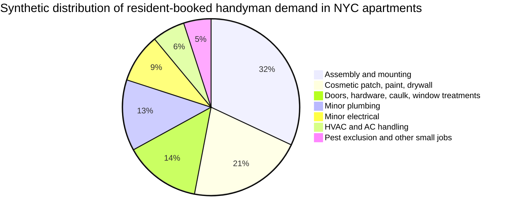
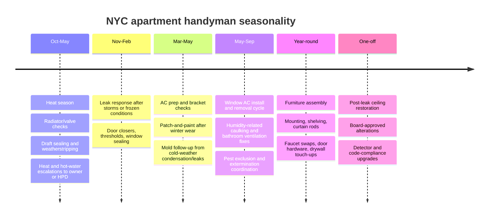
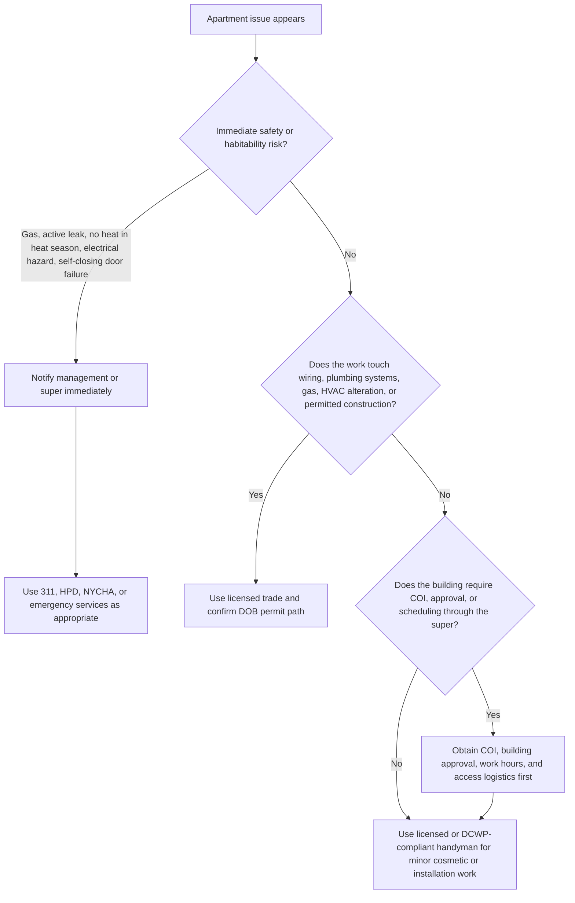

# Handyman Requests in New York City Apartments

## Executive summary

There is no single New York City dataset that counts “handyman requests” as a standalone category. NYC agencies track housing complaints, permits, violations, and public-housing repair tickets, while consumer platforms track bookings by service type. The most rigorous way to answer your question is therefore to separate two overlapping markets: resident-booked small jobs and owner-side maintenance complaints. On the resident-booked side, the dominant NYC apartment tasks are furniture assembly, wall mounting and hanging, drywall/paint touch-ups, door and hardware fixes, and small plumbing jobs. On the building-maintenance side, the highest-volume official issue clusters are heat and hot water, indoor allergens and pests, water leaks and peeling paint, door/window and self-closing-door defects, and electrical problems. That split matters because the first group is often handyman territory, while the second group is frequently a landlord, super, or licensed-trade obligation. citeturn15view6turn15view5turn15view2turn9search0turn9search1turn37search2turn36view0turn38view1

The main practical finding is that NYC apartments generate a lot of small cosmetic and installation work, but NYC’s legal boundary is stricter than many residents assume. If a job costs more than $200 and is “home improvement” work, the contractor generally needs a DCWP Home Improvement Contractor license. Electrical work is especially strict: NYC DOB says no installation or modification to electrical systems can be performed without a permit, and even many “minor” replacements such as fixture and switch work require a Licensed Master Electrician and an electrical permit. Plumbing is more nuanced: some simple like-for-like fixture replacements can be done without a permit or plumbing license, but work that alters building plumbing systems, risers, or gas piping moves quickly into Licensed Master Plumber territory. citeturn24view1turn24view2turn24view0turn32view0turn32view1turn1view2turn33search2

The other major finding is that many NYC apartment jobs are constrained less by city law than by building governance. In co-ops, condos, HDFCs, and many doorman rentals, outside contractors are commonly blocked from starting work without a building-compliant certificate of insurance, management approval, and super coordination. Sample and real NYC alteration agreements require contractor insurance, naming the building and management as additional insureds, notice to or arrangements through the superintendent, weekday-only work windows, and in some buildings even contractor sign-in logs, approved-contractor lists, and union-labor protections. These are not universal city rules, but they are common enough in NYC apartment buildings that they function as de facto market rules. citeturn15view7turn15view8turn15view9turn16view2turn16view1turn18view5turn18view1

## What demand looks like in NYC apartments

Because the data sources describe different slices of the market, the cleanest reading is to rank resident-booked handyman work separately from official apartment-maintenance complaints. The resident-booked ranking below is a composite of recurring service prominence across TaskRabbit NYC, Angi NYC, and Thumbtack local NYC pages. Confidence is highest for the first five rows, moderate for the rest. citeturn15view6turn15view5turn15view2turn9search0turn9search1turn8search2

The chart above is a synthesis, not an official city count. It reflects how often job clusters recur across TaskRabbit NYC’s named apartment services, TaskRabbit’s platform-wide “popular projects,” Angi’s NYC handyman price guide, and Thumbtack’s NYC category activity. Those sources consistently overweight small-installation and cosmetic work relative to heavy building-system repairs. citeturn11search6turn15view6turn15view2turn9search0turn9search1

### Ranked resident-booked tasks

| Rank | Task cluster | Why it ranks high in NYC apartments | Typical cost range | Confidence |
|---|---|---|---|---|
| 1 | Furniture assembly | TaskRabbit and Thumbtack both emphasize assembly as a core apartment service; TaskRabbit lists it among popular projects and Thumbtack has large local assembly marketplaces. citeturn11search6turn15view6turn9search1 | Thumbtack says furniture assembly in New York typically runs about $120–$150; TaskRabbit advertises assembly projects starting at $49. citeturn9search1turn11search6 | High |
| 2 | Mounting and hanging | TaskRabbit NYC explicitly highlights shelves, TVs, art, curtain rods, and AC mounting. Angi lists shelf hanging and TV mounting as common paid handyman jobs. citeturn15view6turn15view2 | Shelves: about $170–$565 in NYC on Angi; TV mounting: about $340–$455 in NYC on Angi; TaskRabbit shows mount-art-or-shelves starting at $65 and TV mounting starting at $69 platform-wide. citeturn15view2turn11search6 | High |
| 3 | Drywall patching and paint touch-up | TaskRabbit NYC and Angi both treat wall repair and paint touch-up as standard apartment work, especially end-of-lease repair. citeturn15view6turn15view2 | Drywall patch: about $140–$395 in NYC on Angi; room painting: about $230–$1,810 per room in NYC on Angi. citeturn15view2 | High |
| 4 | Door, cabinet, and hardware fixes | TaskRabbit NYC lists doors, cabinets, and general minor repairs; Angi lists door adjustment/repair explicitly. citeturn15view6turn15view2 | Door adjustment/repair: about $85–$250 in NYC on Angi. citeturn15view2 | High |
| 5 | Minor plumbing fixes | TaskRabbit NYC offers plumbing and Angi prices faucet replacement; Thumbtack maintains active NYC plumbing categories. citeturn15view5turn15view2turn9search23 | Faucet replacement: about $115–$340 in NYC on Angi; deeper plumbing often shifts to licensed plumber pricing of roughly $150–$250 per hour in NYC. citeturn15view2turn30search0turn30search3 | High |
| 6 | Light fixtures, switches, and small electrical replacements | Commonly requested in practice and listed on TaskRabbit NYC, but heavily constrained by NYC electrical rules. citeturn15view6turn32view0 | Electrician project average about $193–$629 in NYC; local electrician labor often runs about $50–$150 per hour, with minimum fees. citeturn30search1turn30search4 | Moderate |
| 7 | Window AC installation and removal | TaskRabbit NYC specifically lists mounting AC units; NYC apartments rely heavily on window units rather than central systems. citeturn15view6turn33search9 | Often priced at general-handyman hourly rates on platforms; TaskRabbit NYC’s advertised average handyman rate is about $54 per hour. citeturn15view6 | Moderate |
| 8 | Curtain rods, blinds, and window treatments | Explicitly listed by TaskRabbit NYC and common in move-ins and resets. citeturn15view6 | Usually rolled into mounting or handyman hourly pricing; TaskRabbit NYC average is about $54 per hour. citeturn15view6 | Moderate |
| 9 | Ceiling and wall repair after leaks | Very common in older stock after upstairs or facade-related leaks, but often becomes a building-responsibility problem before it becomes a handyman cosmetic repair. citeturn37search2turn17search16 | Ceiling repair in NYC averages about $608–$1,918, with minor jobs much lower and major jobs much higher. citeturn10search4 | Moderate |
| 10 | Pest exclusion prep and minor sealing | Less visible on consumer platforms than mounting or patching, but frequently necessary in NYC apartments with recurring mice and roach issues. citeturn37search1turn38view1 | Pricing varies widely; sealing is often billed at handyman hourly rates, while pesticide application is specialist work rather than handyman work. citeturn15view6turn26search1turn26search2 | Moderate |

The official complaint side looks different. Heat and hot water dominate winter code enforcement. The NYC Comptroller’s 2025 heat report found that tenants in privately owned buildings made an average of 203,920 heat-code complaints per year in the 2022–2024 heat seasons, up 17.3% from the 2017–2021 heat seasons. HPD’s FY25 Indoor Allergen Hazard Report separately recorded 96,345 indoor-allergen complaints, including 38,278 mold complaints, 28,240 roach complaints, and 29,827 mice complaints. NYC311’s apartment-maintenance page also identifies water leaks, peeling paint, doors and locks, broken windows, and electrical problems as common apartment complaint categories. citeturn36view0turn38view1turn37search2

### Ranked building-side complaint clusters

| Rank | Complaint cluster | Best available official signal | What it usually means operationally |
|---|---|---|---|
| 1 | Heat and hot water | Average of 203,920 annual heat-code complaints in the 2022–2024 heat seasons in privately owned buildings. citeturn36view0 | Usually landlord/building boiler or distribution work, not a tenant-hired handyman issue. |
| 2 | Indoor allergens and pests | HPD recorded 96,345 FY25 indoor-allergen complaints, including mold, roaches, and mice. citeturn38view1 | Building-wide envelope, moisture, sanitation, and licensed pest-control problem. |
| 3 | Water leaks, cracks, peeling paint | NYC311 lists these among common apartment maintenance complaints. citeturn37search2 | Often begins as building-system diagnosis, then ends with a cosmetic repair. |
| 4 | Doors, locks, and self-closing doors | NYC311 lists doors and locks that are broken, missing, or not self-closing as common complaints. citeturn37search2 | High safety significance; can shift from handyman hardware work to code issue quickly. |
| 5 | Windows | NYC311 lists broken or stuck windows among common complaint types. citeturn37search2 | Seasonal comfort issue, egress/safety issue, and sometimes building-envelope issue. |
| 6 | Electrical problems | NYC311 lists defective outlets, switches, wet fixtures, and illegal wiring as common complaint types. citeturn37search2 | In NYC this is usually licensed-electrician territory, even when the job looks “minor.” |

## Seasonality, year-round work, and one-off jobs

NYC apartment work has both a strong civic seasonality and a strong building-seasonality. Officially, heat season runs from October 1 through May 31, which is when heat and hot-water failures become the most important maintenance issue. By contrast, common window AC work is concentrated from late spring through early fall because DOB says a common window AC unit generally does not require a work permit unless it exceeds three tons or 36,000 BTU per hour. Mold and pest work is effectively year-round, because HPD and DOHMH treat indoor allergens as continuous habitability issues and HPD recorded large year-round complaint volumes in FY25. citeturn4view1turn36view0turn33search3turn33search9turn37search1turn38view1

### Seasonal, year-round, and one-off task map

| Pattern | Typical months or trigger | Common tasks | Why it matters in NYC |
|---|---|---|---|
| Seasonal winter | October through May heat season | radiator/thermostatic-valve checks, draft sealing, door sweeps, weatherstripping, window caulk, heat-complaint escalation | Heat and hot water are legal essentials; repeated complaints remain a serious citywide issue. citeturn4view1turn36view0 |
| Seasonal cooling | Late spring through early fall | window AC installation, support-bracket inspection, AC removal, sleeve checks, filter cleaning | Window AC is a core NYC apartment task and usually does not need a DOB permit if it is a common unit under the size threshold. citeturn15view6turn33search3turn33search9 |
| Seasonal moisture / infestation | Usually after leaks, humidity, facade penetration, or sanitation decline | bathroom caulk, exhaust-fan repair, mold cleanup setup, pest exclusion, exterminator coordination | HPD’s allergen framework makes mold and pests a building-health issue, not just a nuisance. citeturn37search1turn38view1turn26search1 |
| Year-round | Continuous | furniture assembly, TV/art/shelf mounting, drywall patching, paint touch-up, cabinet and door repair, faucet replacement | These are the tasks that appear over and over on NYC handyman platforms. citeturn15view6turn15view2turn9search1 |
| One-off | Move-in, move-out, after damage, or after approvals | end-of-lease repair, post-leak restoration, floor replacement, wall build-outs, detector upgrades | NYC building rules often convert a small one-off job into an approval and insurance exercise. citeturn15view7turn15view8turn18view5 |

The best shorthand is this: in NYC, mounting, assembly, cosmetic repair, and hardware work are the steady base-load; heating, cooling, moisture, and pest work are the seasonal spikes; and leak restoration, detector compliance, and building-rule-driven alterations are the one-off but operationally expensive events. citeturn15view6turn36view0turn38view1turn28search1

## Core focus areas in NYC apartments

The city-specific focus areas are not evenly weighted. Cosmetic and small-install jobs dominate resident bookings. Safety, plumbing, HVAC, pest, and building-rule compliance dominate risk. Electrical occupies an unusual middle ground: it feels like handyman work to many residents, but DOB regulates it more like licensed-trade work. citeturn15view6turn32view0turn22view2

### Major focus areas and what usually belongs where

| Focus area | What residents ask for most often | What is usually handyman-appropriate | What usually requires escalation |
|---|---|---|---|
| Safety | detector replacement, door closers, locks, leak-damaged ceilings, egress obstructions | small hardware work, non-code-critical adjustments, landlord-approved door hardware | self-closing door failures, missing detectors in rentals/co-ops, unsafe occupied construction, persistent leak damage, gas issues. citeturn37search2turn28search23turn22view2turn22view3 |
| Plumbing | faucet swaps, toilet internals, unclogs, sink hardware | very simple like-for-like swaps and minor visible fixture work may be okay | risers, shutoffs, pressure issues, concealed piping, gas piping, code issues, repeated leaks. citeturn1view2turn33search2turn30search0 |
| Electrical | switch, outlet, sconce, light fixture, ceiling fan | almost none in NYC if it involves electrical installation or modification | DOB says even many minor replacements require Licensed Master Electrician and permit. citeturn32view0turn15view1 |
| Cosmetic | patching holes, repainting, trim, shelves, curtain rods | yes, if building and lease rules allow it, and lead-safe rules do not trigger | any scoped alteration that disturbs regulated paint or requires DOB filing. citeturn15view2turn23search9turn27search1turn27search7 |
| Pest | sealing gaps, under-sink access covers, door sweeps | exclusion prep and sanitation support | pesticide application and building-wide infestations should go to licensed pest-control professionals and management. citeturn37search1turn26search1turn26search2 |
| HVAC | window AC install/remove, brackets, filters, basic vent cleaning | common window AC handling and very small non-permitted maintenance | larger HVAC alterations, permitted mechanical work, or anything beyond common portable/window units. citeturn33search3turn33search9turn33search12turn33search17 |
| Building rules | COI, elevator access, weekday hours, super sign-off, shutoff coordination | paperwork handling and logistics | any job in a co-op/condo/HDFC or strict rental that needs alteration approval or water/electrical shutdown scheduling. citeturn15view7turn15view8turn15view9turn16view1turn18view5 |

### Least requested but vital tasks

These jobs do not dominate platform demand, but they are disproportionately important because they affect safety, legal compliance, or building-wide risk. citeturn28search23turn27search1turn22view3

| Task | Why it is vital | Usually who should handle it |
|---|---|---|
| Self-closing apartment entrance door repair | Fire-safety function; NYC treats non-self-closing doors as a complaint-worthy condition. NYCHA explicitly prohibits disabling them. citeturn37search2turn29view4 | Owner/building staff or approved contractor; tenants should not treat it as a casual hardware job. |
| Smoke and carbon-monoxide detector replacement | Owners in rentals and co-ops must provide and properly install approved devices; HPD tracks detector obligations. citeturn28search23turn28search1 | Owner/building in rentals and co-ops; unit owner in condo/co-op may still need management coordination depending on rules. |
| Lead-safe repair of painted surfaces in older housing | In pre-1960 buildings, lead-safe work practices and certified firms/workers can be required, especially in rentals and turnover work. citeturn27search1turn27search7turn27search15 | Certified workers or EPA-certified renovation/abatement firms, not a generic handyman. |
| Pest treatment using pesticides | NYC DOHMH says pesticides should only be used safely by licensed pest-control professionals; some pesticides may only be used by them. citeturn26search1turn26search3turn26search2 | Licensed pest-control business/applicator. |
| Leak-source tracing and riser shutoff coordination | The visible ceiling stain is often not the real problem; shutoffs and common-line work affect neighbors and building systems. citeturn17search16turn18view5 | Management, super, and licensed plumber where system work is involved. |
| Natural gas detector compliance | HPD and DOB have active gas-detector regulations and timetables; compliance dates have changed, so this is a live rule area. citeturn28search10turn28search13 | Owner/building or qualified installer under the applicable rule set. |

## Legal and regulatory boundaries

The legal boundary in NYC has four layers: consumer-license law, DOB permit law, habitability law, and building-private-governance rules. If you miss any one of those layers, a seemingly simple job can be noncompliant even if the workmanship is fine. citeturn24view1turn15view1turn4view1turn15view7

### What city law says

For general residential “home improvement” work over $200, NYC requires a DCWP Home Improvement Contractor license. DCWP’s June 2026 guidance says that home improvement work includes remodeling or repairs to residential buildings, excludes purely plumbing and purely electrical work, and requires a written contract, cancellation notice, permit disclosure, and no more than 25% upfront payment. DOB’s permit guidance adds another layer: even where a work permit is not needed, that does not waive other city licensing requirements. DOB gives kitchen cabinets as an example of work that may not need a permit but still requires an HIC license. citeturn24view1turn24view2turn24view0turn23search9

Electrical work is the clearest no-go zone for a generic handyman. DOB states that no installation or modification to electrical systems can be performed without a permit, and that even many minor replacements and repairs such as fixture replacements, circuit-breaker replacements, and repair of defective fixtures require a NYC Licensed Master Electrician and an electrical permit. In practical terms, many apartment residents who would casually hire a handyman for a light fixture in another city are in licensed-electrician territory in NYC. citeturn15view1turn32view0turn32view1

Plumbing has a narrower carve-out. DOB’s owner-facing plumbing guidance says some simple repairs and simple replacement of existing faucets, toilets, and sinks may be done without a license and without a permit. But the same DOB framework makes clear that limited plumbing alteration work is reserved to Licensed Master Plumbers, and work exceeding that level requires formal permit documents. Anything involving concealed piping, common risers, water shutoffs, gas piping, or alteration beyond simple visible fixture replacement should therefore be treated as licensed-plumber work. citeturn1view2turn33search2turn30search0

For occupied buildings where permitted construction is happening, DOB requires a Tenant Protection Plan and posting of the Safe Construction Bill of Rights. The TPP exists to protect egress, fire safety, health requirements such as dust control and debris handling, structural safety, noise restrictions, and essential services like heat and hot water. Tenants can check permits and TPP notices in BIS and DOB NOW and can complain through 311 if required notices are missing or work appears unpermitted. citeturn22view0turn22view1turn22view2turn22view3

HPD governs the habitability side. Heat is required during heat season, hot water is required year-round, Local Law 55 requires owners of buildings with three or more apartments to keep units free of mold and pests, and HPD handles complaint intake and code enforcement for private housing through 311. In public housing, NYCHA runs its own repair-ticket process: residents submit requests through the Customer Contact Center or MyNYCHA, maintenance staff assess the issue, and skilled-trade or vendor tickets are created as needed. citeturn4view1turn37search1turn37search5turn29view3

### When a COI is effectively mandatory

A building-entry COI is usually not a universal city-law prerequisite for every small apartment job. It is usually a building rule. But in NYC practice that distinction matters less than people think: if your building requires a COI and your contractor cannot produce one in the exact form demanded, the work often will not start. Brick Underground’s NYC guide says buildings will usually require contractors, repair firms, movers, or suppliers to submit a COI before they can set foot inside, especially in doorman or tightly managed buildings. NYC co-op and condo alteration materials then raise the bar further by requiring the building, managing agent, and often the resident to be named as additional insureds. citeturn15view7turn15view8turn15view9turn16view2

There is also a separate DOB-facing insurance requirement for licensed trades. DOB’s electrical permit rules say Licensed Master and Special Electricians must maintain active insurance with DOB, and that additional project-specific insurance may also be required. So for many apartment jobs there are really two insurance gates: the city gate for the licensed trade and the building gate for access and risk transfer. citeturn15view0

### When superintendent approval is effectively required

“Superintendent approval” is not usually a citywide legal term of art for ordinary in-unit handyman work. It is mostly a building-governance requirement. In practice, however, it is common and often unavoidable. The NYC Bar sample alteration agreement requires advance notice to the superintendent and states that the work must comply with directions from the managing agent or superintendent. A 2024 NYC-area co-op alteration package requires contractors to notify the superintendent before work starts, and the Park Avenue co-op alteration package requires access arrangements through the superintendent, daily worker sign-ins, and advance arrangements for plumbing-riser shutoffs. citeturn15view9turn16view1turn18view5

That means the real rule is not “ask the super because it is polite.” The real rule is that in many NYC apartment buildings the super is the operational gatekeeper for access, water shutoffs, elevator reservations, worker logs, and confirmation that the work scope matches what management approved. If you bypass that layer, your contractor may be turned away even if the job itself would have been lawful. citeturn16view1turn18view5turn20search1

### Practical regulatory matrix

| Task | Permit needed | Licensed trade or license needed | COI commonly needed | Super or management approval commonly needed |
|---|---|---|---|---|
| Furniture assembly | Usually no DOB permit. citeturn23search9 | If over $200 and it is treated as home-improvement work, DCWP HIC rules can still matter; pure furniture assembly is usually the least regulated end of the market. citeturn24view1 | Sometimes, especially in doorman/co-op/condo buildings. citeturn15view7 | Often for access or delivery coordination in managed buildings. citeturn15view7 |
| Shelf, art, and TV mounting | Usually no DOB permit if no structural, plumbing, or electrical system work is involved. citeturn23search9 | DCWP HIC often applies if over $200. citeturn24view1 | Frequently yes in managed buildings. citeturn15view7 | Frequently yes in co-ops/condos and stricter rentals. citeturn15view8turn18view5 |
| Drywall patch and paint touch-up | Usually no DOB permit. citeturn22view3turn23search9 | DCWP HIC over $200; lead-safe certification rules may apply in older housing. citeturn24view1turn27search1turn27search7 | Common in co-ops/condos for outside contractors. citeturn15view7turn16view2 | Often yes if building has house rules. citeturn15view9turn16view1 |
| Simple faucet, toilet, or sink replacement | Some simple visible replacements may be done without permit or license. citeturn1view2 | Once the work goes beyond simple replacement, Licensed Master Plumber territory. citeturn33search2 | Often yes for outside plumbers in managed buildings. citeturn16view2 | Usually yes if shutoffs, risers, or water coordination are involved. citeturn18view5 |
| Plumbing alteration, shutoff, riser or gas work | Usually yes or at least formal plumbing filing. citeturn33search2turn1view1 | Licensed Master Plumber. citeturn33search2turn30search9 | Yes in both city-permit and building-access practice. citeturn15view0turn16view2 | Yes. citeturn18view5 |
| Light fixtures, switches, outlets | Yes. DOB says even many minor replacements require permit. citeturn32view0turn32view1 | Licensed Master Electrician. citeturn15view1turn32view0 | Yes, both DOB-side and often building-side. citeturn15view0turn15view7 | Usually yes in managed buildings. citeturn15view9turn18view5 |
| Common window AC install | Generally no permit if under the threshold and not part of a broader alteration. citeturn33search3turn33search9 | No licensed mechanic automatically required for a common unit, but building rules may still require approved installer. citeturn33search9turn15view7 | Common in doorman/co-op/condo settings. citeturn15view7 | Often yes, because of brackets, access, and facade/window concerns. citeturn15view6turn15view9 |
| Pesticide-based pest treatment | No DOB permit issue; separate environmental rules apply. | Licensed pest-control professional and registered business/applicator where pesticides are used for hire. citeturn26search1turn26search2turn26search13 | Often yes for vendors entering managed buildings. citeturn15view7 | Usually management should know because infestations are often building-wide. citeturn37search1turn37search11 |

### Decision flow

The right operational question is not “Can a handyman technically do this?” It is “Does this job trigger city licensing, building governance, or habitability enforcement?” citeturn24view1turn32view0turn37search5turn15view7

## Building-type differences and union or contractor rules

If no building is specified, the safest baseline assumptions are these: a rental owner is legally responsible for code conditions; a co-op or HDFC usually acts like a board-governed cooperative with stricter approval and insurance requirements; a condo is somewhat more flexible than a co-op but still often heavily managed; and NYCHA public housing uses its own repair-ticket system rather than informal outside handyman arrangements. citeturn29view0turn29view1turn29view2turn29view3

### Comparison by NYC building type

| Building type | Operational reality for handyman work | COI / approval pattern | Key constraint |
|---|---|---|---|
| Rental | The owner remains on the hook for housing-code conditions such as heat, hot water, mold, pests, windows, doors, detectors, and electrical defects. Tenants should treat self-hiring as cosmetic-only unless the landlord approves otherwise. citeturn4view1turn37search5turn37search11 | Varies widely; stricter in doorman or institutional rentals. citeturn15view7 | Lease terms and owner responsibility can make “I’ll just hire my own person” the wrong move for habitability items. |
| Co-op | Shareholder owns shares, not the unit outright; co-op boards have strong control over renovations, subletting, and alterations. citeturn29view0turn29view1 | High likelihood of board/managing-agent package, COI, approved contractors, super coordination, weekday hours. citeturn15view8turn15view9turn16view2turn18view5 | Governance and risk transfer are often stricter than the city law minimum. |
| Condo | Unit ownership is more direct than in a co-op, and condo approval is generally easier than co-op approval, but house rules and managing-agent controls remain common. citeturn29view0 | High for nontrivial work; easier than co-op in some buildings, not all. citeturn15view8 | People overestimate condo flexibility; managed buildings still care about insurance, hours, and common-element risk. |
| HDFC | HPD describes HDFCs as limited-equity co-ops governed by law, regulatory agreements, and the co-op’s own governing documents. citeturn29view2 | Usually co-op-like. citeturn29view2 | Affordability restrictions do not make alteration rules looser; building docs still control. |
| Public housing | NYCHA residents are expected to submit repair tickets through NYCHA channels; NYCHA maintenance staff assess issues and create skilled-trade or vendor tickets. citeturn29view3 | Informal outside handyman use should not be assumed available for routine building obligations. | The process is institutional, not ad hoc. |
| Unionized full-service buildings | Outside contractor access may be shaped by labor realities and building-specific rules on hours, sign-ins, staffing, and in some cases union-labor substitution or approved-contractor lists. citeturn18view1turn18view5 | Very high. | This is where “simple” jobs become expensive because logistics dominate labor time. |

The union and contractor point deserves precision. There is no blanket citywide rule that every apartment handyman job must use union labor. But real NYC co-op alteration packages show that some buildings reserve the right to require union labor, maintain approved-contractor lists, require worker sign-ins, and impose tight weekday work windows. So the correct analytical rule is: union labor is building-specific, but the probability rises in older, full-service, white-glove, and labor-sensitive co-ops and condos. citeturn18view1turn18view5

## Best practices for tenants and handymen

For tenants, the highest-value practice is to classify the issue correctly before hiring anyone. If the issue is habitability-related, already covered by HPD or NYCHA rules, or touches building systems, start with management, the super, or the public agency pathway. Use 311 for private-housing complaints, MyNYCHA or the Customer Contact Center for NYCHA, BIS and DOB NOW to verify permits, and HPD Online to see building complaint and violation history. Do not let a cosmetic-looking symptom fool you into treating a building-system failure like a small handyman job. A ceiling stain is often a leak-source problem. Missing heat is not a handyman problem. Wet light fixtures are not a handyman problem. citeturn37search5turn29view3turn22view2turn35search0turn35search4turn37search2

For tenants procuring small work, the minimum documentation package should be: a written scope, building approval if required, COI if required, contractor license check, permit disclosure if any permit is needed, a dated photo set before work, and a payment trail that avoids cash. DCWP’s own consumer guidance recommends using licensed home-improvement contractors where required, obtaining written estimates and contracts, keeping all paperwork and payments, and avoiding more than 25% upfront. In a co-op or condo, add house rules, elevator rules, work-hour limits, and super coordination to that package before the contractor shows up. citeturn24view1turn24view2turn15view9turn18view5

For handymen, the NYC-standard operating posture should be more formal than in many other cities. At minimum, stay current on DCWP home-improvement licensing if your work falls into that category, understand that electricians and plumbers have separate DOB licensing pathways, carry insurance that can produce building-compliant COIs quickly, and ask for building rules before quoting. If you quote without asking about COI wording, elevator availability, weekday-only work windows, super coordination, or shutoff scheduling, your estimate is probably wrong. Angi’s NYC plumbing guides explicitly note that co-op and condo approvals, insurance proof, and water shutoff scheduling affect timelines and labor cost. citeturn24view0turn24view1turn15view0turn30search3

The escalation path should also be explicit in writing. For private housing, if management does not resolve habitability problems, escalate through 311 and HPD. For construction-safety issues, use DOB channels and check the Safe Construction Bill of Rights and TPP notice. For contractor misconduct on home-improvement work, use DCWP complaint channels. For NYCHA, stay inside the NYCHA repairs process rather than freelancing around it. That escalation ladder is part of the job, not paperwork after the fact. citeturn37search5turn22view2turn22view3turn23search17turn29view3

**TL;DR:** In NYC apartments, the most frequent resident-booked handyman jobs are assembly, mounting, patch-and-paint, door/hardware work, and small plumbing fixes, while the biggest official maintenance burdens are heat/hot water, pests and mold, leaks, doors/windows, and electrical problems. The hard line is legal and operational: jobs over $200 often trigger DCWP home-improvement rules, electrical work is tightly controlled by DOB, plumbing turns licensed fast once it reaches building systems, and many co-ops/condos will not allow outside work without a COI, management approval, and super coordination. In practice, NYC apartment maintenance is as much about governance and risk transfer as it is about the repair itself.